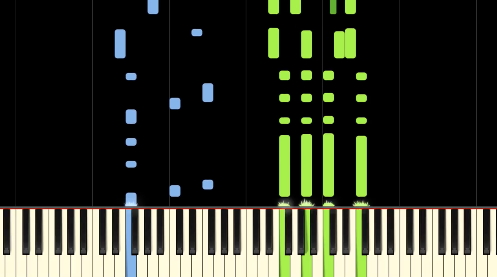
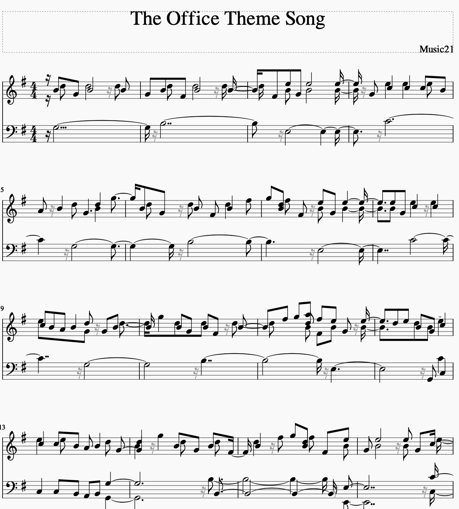

# Synthesia Video -> Sheet Music

Converts a Synthesia `.mp4` (left) to a MuseScore `.xml` file (right):

Synthesia `.mp4`            | to | MuseScore `.xml`
:-------------------------:|:-:|:-------------------------:
 | => | 

## How to Run

`python3 script.py name_of_mp4_in_same_directory`

## Bug Fix for Music21

Music21, the library used to generate the `.xml` file, sometimes adds unnecessary rests.

To fix this issue, replace `/usr/local/lib/python3.x/site-packages/music21/stream/__init__.py` with the `__init__.py` in this repository. Replace `x` with your version of Python 3. (This is optional, but makes the output easier to read)

## Additional Info

For detailed list of options:

`python3 script.py -h`

**NOTE:** The `.mp4` file must be trimmed such that the keyboard is clearly visible in the first frame of the video.

## Areas for Improvement

**Good:** The conversion from Synthesia `.mp4` to a list of notes (containing info on when those notes were hit, how long they were held, and which hand [left/right] they corresponded to), is functionality that works pretty accurately. That code is in `SynthesiaToSong.py`.

**Bad:** The weakest link in this pipeline is the code that converts the list of notes output by `SynthesiaToSong.py` to actual sheet music, which is in `SongToSheet.py`. It has no understanding of music theory, so it will try to hack-ily map each played note to an actual musical note (e.g. quarter, half, whole note), and doesn't do a great job of lining up notes that should be played together if the actual frame in the `.mp4` video on which they were hit is different. Modifying this file to better translate a list of frequencies and their timestamps to actual musical notation is the key for improving this pipeline's output.